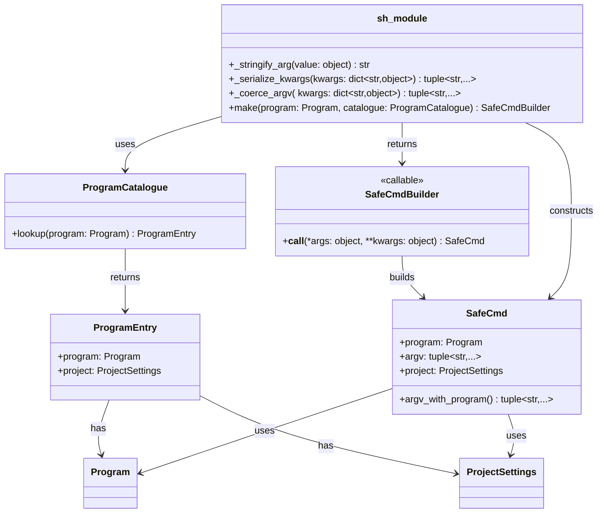

# Cuprum

A typed, async, observable command execution library for Python 3.12+

______________________________________________________________________

## 1. Overview

Cuprum is a Python library for running external commands in a way that is
**type-aware, observable, and concurrency-friendly**, intended as a modern
replacement for ad‑hoc shell scripts and stringly‑typed `subprocess` calls.

It is inspired by libraries like `plumbum` and the `sh` package, but takes a
more opinionated stance on:

- **Compile‑time safety** – use the typechecker and curated builders to
  constrain *what* can be executed and *how* arguments are constructed.
- **Contextual safety at runtime** – scoped allowlists and hooks applied via
  execution contexts, not process‑global switches.
- **Async‑first execution** – support for `asyncio` (and by extension
  structured concurrency) as a first‑class concern.
- **Observability** – logging, tracing, and metrics hooks with structured,
  `logging`‑compatible events, including a principled equivalent of Bash’s
  `set -x`.

The primary target is **utility and automation code** that would otherwise be
implemented as shell scripts or piecemeal `subprocess` usage: deployment
helpers, CI/CD glue, maintenance scripts, administration tools, and service
orchestration logic.

This document describes the intended behaviour and public surface of Cuprum. It
deliberately avoids locking in a specific internal class layout; the goal is to
give implementers a clear, consistent direction rather than a rigid blueprint.

______________________________________________________________________

## 2. Goals and Non‑Goals

### 2.1 Goals

Cuprum aims to:

- Provide a **safe, explicit default API** for running commands:
  - commands are identified by curated `Program` values, not arbitrary strings;
  - high‑level code calls *builders* rather than assembling argv by hand.
- Offer a **tiered interface**:
  - a low‑level core for fine‑grained control over execution, I/O, and
    environment;
  - a high‑level `sh` facade that makes common scripting patterns concise and
    safe.
- Support **asynchronous execution and structured concurrency**:
  - single commands and pipelines must be awaitable;
  - cancellation must terminate subprocesses cleanly.
- Provide **tee‑style output handling** as a first‑class feature:
  - echo to terminal or logger while capturing for later processing.
- Integrate with **Python’s logging ecosystem** and observability stacks:
  - structured events for command start/finish/output;
  - pluggable hooks for metrics and tracing.
- Make unsafe patterns **visibly unsafe**:
  - dynamic / unchecked commands live in a separate namespace or type;
  - widening allowlists and bypassing builders is possible but explicit.

### 2.2 Non‑Goals

Cuprum does *not* aim to:

- Become a full shell replacement (no general shell grammar, globbing,
  conditionals, etc.).
- Automatically discover every executable on a system or generate builders from
  `$PATH`.
- Encode full pipeline structure or shell semantics in the type system.
- Provide remote execution, SSH orchestration, or process supervision beyond a
  single host.

Cuprum is a **local command runner** with a strong bias towards clarity and
safety, not a general-purpose shell framework.

______________________________________________________________________

## 3. Problems with Existing Approaches

Python’s `subprocess` module is powerful but low-level. In practice, code
frequently runs into the following issues:

1. **Stringly APIs and shell injection risk**
   - Ad‑hoc calls like `subprocess.run(f"rm -rf {user_input}", shell=True)` are
     compact but fragile and dangerous.
   - Even when `shell=False` is used, `argv` strings are manually constructed
     across the codebase with little centralisation or validation.

2. **No compile‑time structure**
   - Every command is just a `list[str]` or a bare `str`; type checkers cannot
     distinguish `"git"` from `"rm"`, or a path from a ref.
   - There is no way to encode at the type level “this function can only run
     `git status`, not arbitrary commands”.

3. **Awkward output handling**
   - The standard APIs force a choice between
     `check_output`/`run(..., capture_output=True)` (capture but no streaming)
     and letting the process inherit `stdout`/`stderr` (streaming but no
     capture).
   - Implementing tee‑like behaviour requires manual threads or async loops.

4. **Limited observability**
   - There is no standard way to log or trace *which commands* are executed and
     *how* (arguments, cwd, env diffs, timings).
   - Bash’s `set -x` has no direct analogue; developers often print commands
     manually, inconsistently.

5. **Async and structured concurrency are tedious**
   - `asyncio.create_subprocess_exec` exists but requires significant plumbing
     to handle I/O, cancellation, and error propagation.
   - Spawning multiple commands concurrently and tying them into an
     application’s lifecycle is repetitive and error‑prone.

6. **Globals and hidden state**
   - Many wrappers (including innocent ones) rely on module‑global
     configuration and side effects that are hard to reason about in concurrent
     or test scenarios.

Cuprum is designed explicitly to address these issues.

______________________________________________________________________

## 4. Design Principles

Cuprum’s behaviour is guided by a small set of principles:

### 4.1 Compile‑Time First, Runtime as Backstop

Wherever possible, Cuprum pushes safety into **static structure**:

- commands are represented by a `Program` NewType rather than arbitrary strings;
- arguments with special semantics (filesystem paths, git refs, patterns) are
  represented by their own NewTypes or builder types;
- high‑level code calls command builders that assemble argv in one place.

Runtime checks (allowlists, hooks, argument validation) still exist, but are
treated as **defence in depth**, not the primary enforcement mechanism.

### 4.2 Explicit and Non‑Magical

Magic APIs such as `from sh import grep` or `sh.ls` implicitly bound to
whatever is on `$PATH` are avoided in the core design:

- the primary way to obtain a command is `sh.make(program)` where `program` is
  a `Program` defined in curated code;
- optional syntactic sugar may exist, but only after explicit registration, and
  never via implicit PATH introspection.

This improves readability, type‑checking, and auditability.

### 4.3 Contextual Safety, not Process‑Global Knobs

Cuprum maintains a per‑execution **context** backed by a `ContextVar`. A
context holds:

- the current allowlist of permitted `Program` values;
- the registered pre‑ and post‑execution hooks;
- configuration related to logging and observability.

Contexts can be **nested** (via context managers) and are **scoped** to logical
tasks (threads and async tasks), rather than a single process‑global state.
This makes it possible to:

- enforce different policies in different subsystems;
- write tests that adjust Cuprum’s behaviour without affecting other tests;
- enable debugging hooks or tracing for a specific block of code.

### 4.4 Async‑First, with Sync Parity

Cuprum is built on top of `asyncio` (or a compatible abstraction) and treats
asynchronous execution as the default. Every operation should have:

- an **async** method (`await cmd.run()`, `await pipeline.run()`), and
- a **sync** convenience method (`cmd.run_sync()`) that simply drives the event
  loop under the hood.

This ensures Cuprum integrates cleanly with async applications while remaining
usable from simpler scripts.

### 4.5 Observability as a First‑Class Concern

Command execution is an important part of a system’s behaviour. Cuprum exposes
**structured events** for:

- command planning (intention to run);
- command start (including resolved argv, cwd, env diff, pid);
- stdout/stderr output (optional, per line or per chunk);
- command completion (exit status, duration).

Users can attach hooks that:

- log these events via `logging`;
- emit metrics or traces;
- perform custom auditing.

This is the analogue of `set -x`, but integrated with modern observability
tooling.

______________________________________________________________________

## 5. Conceptual Model

### 5.1 `Program` – identifying executables

A `Program` is a small, nominal type describing an executable Cuprum may run:

```python
from typing import NewType

Program = NewType("Program", str)
```

Projects define their own curated set of programs in modules that are easy to
review, e.g.:

```python
# cmds.py
from cuprum import Program

LS = Program("ls")
GREP = Program("grep")
GIT = Program("git")
```

Higher‑level code imports these names instead of sprinkling raw strings
throughout the codebase. This is both a readability and safety device:
grep‑and‑replace, review, and static analysis become easier.

#### 5.1.1 Catalogue metadata

A `ProgramCatalogue` defines the curated allowlist that guards the safe command
surface. Each entry belongs to a `ProjectSettings` record that holds:

- `programs`: curated `Program` values owned by the project;
- `documentation_locations`: runbooks or background docs for reviewers and
  operators;
- `noise_rules`: output patterns downstream loggers may drop to cut chatter.

Cuprum ships with `DEFAULT_CATALOGUE`, anchored by the `core-ops` project and
extended with project-specific metadata. The catalogue rejects unknown
executables via `UnknownProgramError`, making the allowlist the default gate.
Downstream services (for example, logging hooks) can call `visible_settings()`
to read noise rules and documentation links without mutating the catalogue.

### 5.2 Safe vs Dynamic Commands

Cuprum distinguishes between:

- **`SafeCmd[Out]`** – commands created from curated `Program` values and typed
  argument builders;
- **`DynamicCmd[Out]`** – commands constructed directly from arbitrary argv
  (user input, legacy integration).

The public “safe” API produces `SafeCmd` instances. The `cuprum.unsafe`
namespace exposes functions that construct `DynamicCmd` for the rare cases
where arbitrary composition is required.

High‑level facilities (pipelines, context‑scoped allowlists, etc.) are
optimised for `SafeCmd`. You can adapt a `DynamicCmd` into these facilities,
but doing so is visually explicit and reviewable.

### 5.3 Execution Context

An execution context (`CuprumContext`) contains the current configuration for
command execution in a logical scope:

- **allowlist:** `frozenset[Program]` – which programs are permitted;
- **before hooks:** a list/tuple of callbacks invoked prior to execution;
- **after hooks:** callbacks invoked after completion;
- **output hooks (optional):** callbacks observing stdout/stderr lines;
- **misc flags:** future extension point (e.g. default echo behaviour).

Internally, a `ContextVar[CuprumContext]` holds the current context. Public
APIs (`sh.allow`, `sh.before`, `sh.scoped`) update this context in a controlled
way.

Contexts are nested: entering a new `with sh.scoped(...)` creates a derived
context, and exiting restores the previous one. This behaves correctly across
threads and async tasks.

### 5.4 Hooks

Cuprum supports three “levels” of hooks, all backed by the same underlying
mechanism:

- **Context‑wide hooks:** registered via `sh.before` / `sh.after`, affecting
  all commands in the current context.
- **Scoped hooks:** registered via context managers (`with sh.before(...):`,
  `with sh.scoped(before=[...]):`), active only in a block.
- **Per‑command hooks:** attached to a specific `SafeCmd` instance
  (`cmd.before(...)`, `cmd.after(...)`).

All registrations return a `HookRegistration` object with:

- `.detach()` – to remove the hook from the current context; and
- context manager methods – so `with sh.before(hook): ...` is equivalent to
  register‑for‑block.

Allowlist modifications use an analogous mechanism, returning
`AllowRegistration` objects that can also be used as context managers.

______________________________________________________________________

## 6. Public API Surface

Cuprum’s public surface is divided into three layers:

- `cuprum.core` – low‑level primitives (`Program`, base command types, result
  objects);
- `cuprum.sh` – high‑level facade for safe command execution and context
  manipulation;
- `cuprum.unsafe` – explicitly marked, less‑safe constructors for
  dynamic/legacy usage.

### 6.1 Core Types (conceptual)

> **Note:** Names here are illustrative; implementers may adjust module/class
> names as long as the behaviour matches.

#### 6.1.1 `Program`

Nominal identifier for an executable, as described above:

```python
Program = NewType("Program", str)
```

#### 6.1.2 `SafeCmd[Out]`

Represents a prepared command instance that, when run, yields an `Out` value
(e.g. `str`, `bytes`, or a user type):

- constructed from a `Program` and arguments;
- carries execution options (cwd, env overrides, timeout, echo options);
- exposes both async and sync run methods.

Example (type sketch, not final signature):

```python
class SafeCmd(Generic[Out]):
    program: Program
    argv: tuple[str, ...]  # not including program name

    def before(self, hook: BeforeHook) -> "SafeCmd[Out]": ...
    def after(self, hook: AfterHook) -> "SafeCmd[Out]": ...

    async def run(self, *, capture: bool = True, echo: bool = False) -> Out: ...
    def run_sync(self, *, capture: bool = True, echo: bool = False) -> Out: ...

    def __or__(self, other: "SafeCmd[Any]") -> "Pipeline[Out]": ...
```

#### 6.1.3 `DynamicCmd[Out]`

Similar shape to `SafeCmd`, but constructed from raw argv. Only created through
`cuprum.unsafe` or deliberate adapters.

#### 6.1.4 `Pipeline[Out]`

Represents a pipeline of commands connected via stdin/stdout:

```python
class Pipeline(Generic[Out]):
    parts: tuple[SafeCmd[Any], ...]

    async def run(self, *, capture: bool = True, echo: bool = False) -> Out: ...
    def run_sync(self, *, capture: bool = True, echo: bool = False) -> Out: ...
```

For the public design, the exact generic parameters are kept simple: we do
**not** attempt to encode full pipeline structure at the type level.

### 6.2 `cuprum.sh` – Safe Facade

The `sh` facade provides the main entry point for safe usage.

#### 6.2.1 Creating commands

The primary constructor is
`sh.make(program: Program) -> Callable[..., SafeCmd[str]]`:

```python
from cuprum import sh, Program
from cmds import LS, GREP  # curated Program values

ls = sh.make(LS)
grep = sh.make(GREP)

cmd = ls("-l", "/var/log")
result = cmd.run_sync(echo=True)
print(result)  # `result` is text output by default
```

`sh.make` returns a callable that accepts positional/keyword arguments to be
converted into argv strings according to internal rules (e.g. str() with basic
quoting, or more elaborate conversions later). For more control, projects are
expected to wrap `sh.make` with **builders** (see below).

#### 6.2.2 Command builders

Command builders centralise and type arguments for a given command. Builders
are regular functions defined by the host project, not generated by Cuprum:

```python
from typing import NewType
from pathlib import Path
from cuprum import sh, Program

Program = Program  # alias for clarity
SafePath = NewType("SafePath", str)

LS = Program("ls")

def safe_path(p: Path) -> SafePath:
    # e.g. enforce absolute paths, prevent "..", etc.
    return SafePath(p.as_posix())

def ls(path: SafePath | None = None, long: bool = False) -> SafeCmd[str]:
    args: list[str] = []
    if long:
        args.append("-l")
    if path is not None:
        args.append(path)
    return sh.make(LS)(*args)

# Usage
result = ls(safe_path(Path("/var/log")), long=True).run_sync(echo=True)
```

Builders:

- hide `sh.make` in one place;
- perform argument validation and normalisation;
- serve as the primary public API within a codebase (`ls(...)`,
  `git_checkout(...)`, etc.).

#### 6.2.3 Pipelines

Safe commands can be composed into pipelines using an operator:

```python
from cmds import LS, GREP
from cuprum import sh

ls = sh.make(LS)
grep = sh.make(GREP)

pipeline = ls("-l", "/var/log") | grep("ERROR")
text = pipeline.run_sync(echo=True)
```

##### Implementation notes for the first iteration

- `sh.make` validates the program against the active catalogue when the builder
  is created, surfacing `UnknownProgramError` immediately.
- Positional arguments are stringified with `str()`. Keyword arguments are
  serialized as `--flag=value`, replacing underscores with hyphens in flag
  names to align with common CLI conventions.
- `None` is rejected as an argument value to catch accidental omissions early;
  builders should decide whether to omit the flag or substitute a value.
- `SafeCmd` instances carry the owning `ProjectSettings`, making catalogue
  noise rules and documentation links visible to downstream hooks without an
  extra lookup.

The following diagram summarizes the relationships in the typed command core:



Under the hood, this produces a `Pipeline[str]` instance, starts all component
processes concurrently, and streams data between them. `echo=True` enables
tee‑style behaviour (see §8).

#### 6.2.4 Context manipulation and allowlists

The `sh` facade exposes operations for manipulating the current execution
context.

**Allowing programs in the current context:**

```python
from cuprum import sh
from cmds import GIT, LS

# Extend current context’s allowlist
reg = sh.allow(GIT, LS)

# ... commands here can run GIT and LS ...

reg.detach()  # remove these from the allowlist again
```

`sh.allow` returns an `AllowRegistration`, which can also be used as a context
manager:

```python
from cuprum import sh
from cmds import RSYNC

with sh.allow(RSYNC):
    # RSYNC temporarily added to the allowlist in this block
    await run_backup()
# RSYNC no longer allowed (unless allowed by an outer scope)
```

Context managers build on a `ContextVar` so they behave correctly with threads
and async tasks.

**Scoped contexts:**

`sh.scoped` creates a nested execution context with optional allowlist and
hooks:

```python
from cuprum import sh
from cmds import GIT

async def deploy():
    async with sh.scoped(allow={GIT}, before=[audit_hook], after=[metrics_hook]):
        cmd = make_git_deploy_cmd()
        await cmd.run()
```

`sh.scoped` semantics:

- Derive a new context from the current one.
- Optionally **narrow** the allowlist to the provided set (typically an
  intersection with the parent’s allowlist; exact rule is to be defined but
  must never silently introduce programs unknown to the baseline configuration
  in “safe” mode).
- Extend hooks with the provided `before`/`after` lists.
- Restore the previous context on exit.

#### 6.2.5 Hooks via `sh.before` / `sh.after`

Hooks are callbacks that observe or modify execution around commands.

Example:

```python
from cuprum import sh

def log_before(cmd):
    logger.info("About to run %s", cmd)

def log_after(cmd, result):
    logger.info("Done %s: exit=%s", cmd, result.exit_code)

# Register context-wide hooks
before_reg = sh.before(log_before)
after_reg = sh.after(log_after)

# Hooks apply to all commands in this context
await do_some_work()

before_reg.detach()
after_reg.detach()
```

As with allowlists, hooks can be registered for a limited scope:

```python
with sh.before(log_before):
    await do_debuggy_thing()
# hook no longer active here
```

Per‑command hooks are attached directly to `SafeCmd` instances:

```python
cmd = make_deploy_cmd()
cmd.before(per_call_before).after(per_call_after)
await cmd.run()
```

Hook call order is deterministic. A reasonable order is:

- **before:** global/baseline → outer context → inner context → per‑command;
- **after:** per‑command → inner context → outer context → global/baseline.

Exact ordering must be documented when implemented.

### 6.3 `cuprum.unsafe` – Explicit Escape Hatch

The `cuprum.unsafe` namespace houses constructors and helpers that bypass some
of the safe‑by‑construction guarantees:

Examples (conceptual):

```python
from cuprum import unsafe

# Construct from raw argv (no Program NewType, no builder)
cmd = unsafe.command_from_argv(["bash", "-lc", user_supplied_script])
await cmd.run()
```

or

```python
from cuprum import sh, unsafe

cmd = unsafe.dynamic("/usr/local/bin/custom-tool", "--flag", user_input)
await cmd.run()
```

These commands **still** pass through the runtime allowlist (if enabled) and
hooks, but their use should be rare and clearly marked for code review.
Documentation should strongly discourage wrapping arbitrary user input in these
calls without higher‑level validation.

______________________________________________________________________

## 7. Observability and Logging

Cuprum provides primitives to make command execution observable in a structured
way.

### 7.1 Execution Events

Internally, command execution can be described in terms of events:

- `plan` – intention to run a particular `Program` with argv/cwd/env;
- `start` – process successfully spawned, with pid and timestamp;
- `stdout` / `stderr` – output lines or chunks (optional);
- `exit` – process finished, with exit code and duration.

These events are surfaced to user code via hooks. A typical hook signature
might be:

```python
@dataclass class ExecEvent:
    phase: Literal["plan", "start", "stdout", "stderr", "exit"]
    program: Program | None
    argv: tuple[str, ...]
    cwd: Path | None
    env: Mapping[str, str] | None
    pid: int | None
    timestamp: float
    line: str | None
    exit_code: int | None
    duration_s: float | None
    tags: Mapping[str, object]

ExecHook = Callable[[ExecEvent], None | Awaitable[None]]
```

The concrete shape is an implementation detail, but the design assumes:

- Events can be consumed synchronously or asynchronously.
- Hooks may choose to ignore most phases and only act on `start`/`exit`.

### 7.2 Logging via `logging`

A common usage pattern is to register a hook that logs events using the
standard `logging` module.

Example:

```python
def log_to_logging(ev: ExecEvent) -> None:
    if ev.phase == "start":
        logger.info(
            "cuprum.start program=%s argv=%r cwd=%s pid=%s",
            ev.program, ev.argv, ev.cwd, ev.pid,
        )
    elif ev.phase == "exit":
        logger.info(
            "cuprum.exit program=%s exit=%s dur=%.3fs",
            ev.program, ev.exit_code, ev.duration_s or 0.0,
        )

with sh.before(lambda cmd: None), sh.observe(log_to_logging):
    await run_workload()
```

(The exact `sh.observe` API is left open; it may be implemented as a
specialised hook registration.)

This provides a structured, configurable alternative to `set -x`: instead of
printing opaque lines to stderr, events go through the logging system with
fields that log processors can inspect, filter, and route.

### 7.3 Metrics and Tracing

The same events can feed into metrics and tracing systems:

- A metrics hook can increment counters and record durations based on
  `start`/`exit` events (e.g. Prometheus or OpenTelemetry metrics).
- A tracing hook can start and finish spans per command, attaching program
  name, argv, and exit code as span attributes.

Cuprum itself should not depend on any particular telemetry library; instead,
it should offer hooks that are trivial to adapt to whatever the host
application uses.

### 7.4 Tee and Output Observation

Cuprum’s tee behaviour (echo while capturing) is implemented by reading from
subprocess stdout/stderr and writing to:

- a capture buffer (per command/pipeline), and
- configured sinks (e.g. `sys.stdout`, `sys.stderr`, or logging hooks).

Output hooks may be invoked on each line or chunk. Care must be taken to:

- avoid blocking the event loop on slow sinks (e.g. logging to a remote
  service);
- handle partial lines correctly.

Users should be able to choose:

- `echo=True, capture=True` – tee behaviour;
- `echo=True, capture=False` – stream only;
- `echo=False, capture=True` – capture silently.

______________________________________________________________________

## 8. Async Execution Model

Cuprum builds on `asyncio.create_subprocess_exec` (or an equivalent
abstraction) for process execution.

### 8.1 Single Command Execution

For a single `SafeCmd`:

- `cmd.run()` starts the process and awaits its completion;
- stdin can be provided as a bytes object, string, or async iterator (design
  detail);
- stdout/stderr are read asynchronously, optionally feeding tee sinks and
  capture buffers;
- on completion, `run()` returns the captured output (or a richer result
  object).

Cancellation behaviour:

- If the surrounding task is cancelled while a command runs, Cuprum must send a
  termination signal to the subprocess and wait (with a configurable grace
  period) before killing it.
- Cancellation must also clean up any background tasks used for I/O.

### 8.2 Pipelines and Structured Concurrency

For pipelines, Cuprum must:

- spawn all component processes;
- connect stdout of each process to stdin of the next using pipes;
- run I/O loops that shuttle data between processes without deadlocking (e.g.
  non‑blocking reads/writes, backpressure awareness);
- coordinate completion: a pipeline finishes when the last process exits;
  intermediate failures must be handled according to defined policy.

Using `TaskGroup` (where available) or an equivalent pattern, Cuprum treats the
pipeline as a **single structured task**: entering the context starts all
subprocesses, leaving it ensures they are either completed or terminated.

Error propagation policy (to be finalised, but roughly):

- If an earlier stage in the pipeline fails, Cuprum may terminate later stages
  or allow them to drain, depending on configuration.
- The overall pipeline result should surface enough information to diagnose
  which stage failed (e.g. via an exception that carries a list of stage
  results).

### 8.3 Parallel Execution (non‑pipeline)

Running multiple unrelated commands concurrently is a straightforward
extension: Cuprum can offer a helper (or rely on user‑managed `asyncio.gather`)
that runs several `SafeCmd` instances at once, respecting the same cancellation
semantics.

______________________________________________________________________

## 9. Error Model

Cuprum should define a small hierarchy of exceptions for error conditions, for
example:

- `CuprumError` – base class for all library errors.
- `ForbiddenProgramError` – attempting to run a `Program` not in the current
  allowlist.
- `ExecutionFailed` – a command/pipeline exited with non‑zero status when
  `check=True`.
- `PipelineError` – aggregate error when a multi‑stage pipeline fails.
- `UnsafeUsageWarning` (as a warning class) – emitted when obviously risky
  patterns are detected (e.g. dynamic command from raw user input without
  validation).

The default behaviour for the high‑level API:

- `run()` raises `ExecutionFailed` if exit code is non‑zero, including captured
  stderr and other context in the exception.
- Callers can opt out with `check=False` and inspect the return value instead.

Pipeline errors should be particularly well documented, as debugging failures
in multi‑stage flows is otherwise painful.

______________________________________________________________________

## 10. Security Considerations and Recommended Patterns

Cuprum cannot **prevent** misuse, but it can:

- make safe patterns ergonomic; and
- make unsafe patterns obvious and easy to flag in review and tooling.

Key recommendations that the design encourages:

- Map user‑visible actions to **builders**, not to arbitrary command strings.
  For example:

  ```python
  actions: dict[str, Callable[..., SafeCmd[str]]] = {
      "status": git_status,
      "deploy": git_deploy,
  }

  cmd = actions[user_choice](...)
  await cmd.run()
  ```

  Here, the user controls *which builder* is called, but not the argv contents
  directly.

- Avoid passing raw, unvalidated user input into `Program` or `unsafe`
  constructors.

- Use `Program` values and NewTypes (e.g. `SafePath`, `GitRef`, `SafePattern`)
  to encode assumptions at the type level.

- Restrict `cuprum.unsafe` to well‑understood integration points (e.g. calling
  a legacy shell wrapper) and keep its use centralised.

Documentation should explicitly **pour scorn** on patterns like
`unsafe.command_from_argv(user_input.split())` without prior validation, and
provide better alternatives.

______________________________________________________________________

## 11. Implementation Phases

A phased implementation helps ensure a solid core before advanced features.

### 11.1 Phase 1 – Foundation

Focus:

- **Core command representation:**
  - `Program` NewType;
  - `SafeCmd[str]` representing a single command with text output;
  - `sh.make(program)` returning callables that create `SafeCmd`.

- **Execution context and allowlists:**
  - `CuprumContext` stored in a `ContextVar`;
  - `sh.allow` / `AllowRegistration` with `.detach()` and context manager
    support;
  - semantics for narrowing/deriving allowlists.

- **Basic hooks:**
  - `sh.before` / `sh.after` with registration and scoping as described;
  - per‑command hooks on `SafeCmd`.

- **Single command execution:**
  - async `run()` and sync `run_sync()` for `SafeCmd`;
  - optional tee behaviour (echo + capture) for stdout/stderr;
  - cancellation behaviour that terminates the subprocess.

- **Minimal observability:**
  - basic execution events for `start` and `exit` exposed to hooks;
  - a simple logging hook implementation as example.

At the end of Phase 1, Cuprum should be usable for simple scripts that run
single commands with good safety and observability.

### 11.2 Phase 2 – Pipelines and Rich Observability

Focus:

- **Pipeline support:**
  - `Pipeline[str]` as composition of `SafeCmd`;
  - full streaming behaviour between stages;
  - defined error propagation and cancellation semantics.

- **Parallel execution helpers:**
  - convenience APIs for running multiple commands concurrently (or
    documentation for how to do it with `asyncio.gather`).

- **Extended observability:**
  - richer `ExecEvent` shapes (stdout/stderr lines, tags);
  - example integrations with OpenTelemetry (spans) and metrics libraries.

### 11.3 Phase 3 – Builder Libraries and Optional Sugar

Focus:

- Provide optional, project‑agnostic builder sets for common tools (`git`,
  `tar`, `rsync`), as separate packages or modules.
- Consider optional sugar layers (e.g. opt‑in attribute access like
  `sh.register("ls", LS)`, enabling `sh.ls`) while preserving the explicit core.
- Refine APIs based on feedback and real‑world usage, without compromising the
  core safety and context model.

______________________________________________________________________

## 12. Summary

Cuprum is intended to make “Python instead of shell scripts” a genuinely safe,
pleasant choice:

- **Safe by default** via curated `Program` values, builders, and NewTypes.
- **Contextual safety** via scoped allowlists and hooks backed by `ContextVar`.
- **Async‑first** while still friendly to synchronous scripts.
- **Observable** through structured logging and pluggable telemetry hooks.
- **Explicitly unsafe escape hatches** for the few places where dynamic
  behaviour is unavoidable.

This document defines the desired behaviour and public surface. Implementers
should treat it as a set of behavioural contracts and design constraints rather
than a rigid class diagram, and should favour boring, explicit implementations
over cleverness—especially in the type‑system and configuration layers.
